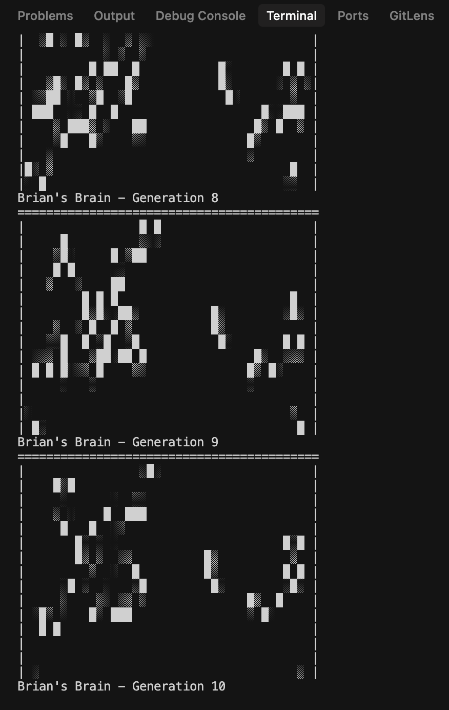

# Brian's Brain Cellular Automaton

This project simulates Brian's Brain, a 2D cellular automaton with three cell states: OFF (0), ON (1), and DYING (2).

## Project Files

- `main.py` - CLI and main loop
- `brain.py` - Core simulation
- `test_brain.py` - Tests for the simulation logic
- `sample_seed.txt` - Example pattern


## How to Run

Run with a seed file:
```
python3 main.py --seed-file sample_seed.txt --generations 200 --width 40 --height 20 --output-dir output
```

Or generate a random seed:

```
python3 main.py --random-seed 42 --generations 200 --width 40 --height 20 --output-dir output
```

## Example output



## Running Tests

```
python3 test_brain.py
```

## Seed File Format

Each line is a row. Use 0/1/2 for OFF/ON/DYING cells.

Example (`sample_seed.txt`):

```
00000
00100
00010
01210
00000
```

## Controls

- Press `Ctrl+C` to stop the simulation early
